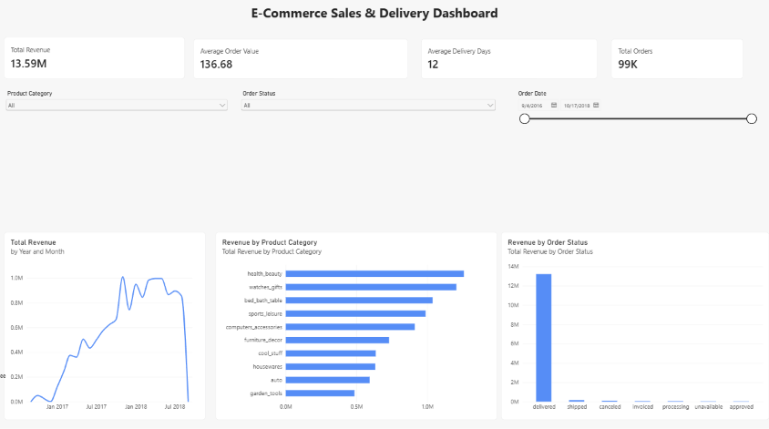

# Olist E-Commerce Power BI Analysis

## Project Overview
This project analyzes the Olist Brazilian E-Commerce dataset using Power BI to understand sales performance, order trends, product categories, and delivery performance.

The project includes data transformation, data modeling, DAX measures, interactive slicers, and an interactive Power BI dashboard.

## Dashboard Preview



## Key KPIs
- Total Revenue: 13.59M
- Total Orders: 99K
- Average Order Value: 136.68
- Average Delivery Days: 12

## Analysis Performed
- Monthly revenue trend analysis
- Revenue analysis by product category
- Revenue analysis by order status
- Delivery performance analysis
- Average freight value analysis
- Average order value analysis
- Top product categories by revenue

## Power BI Skills Used
- Power Query
- Data Cleaning & Transformation
- Data Modeling & Relationships
- Merge Queries
- DAX Measures
- KPI Cards
- Date Hierarchies
- Top N Filtering
- Slicers & Interactive Filtering
- Data Visualization
- Dashboard Design

## DAX Measures
Examples of measures created during the project:

```DAX
Total Revenue = SUM(olist_order_items_dataset[price])
Average Order Value =
DIVIDE([Total Revenue], [Total Orders])
Average Delivery Days =
AVERAGE(olist_orders_dataset[delivery_days])
